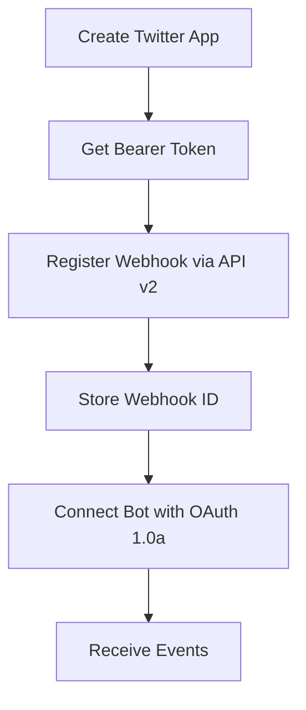

# X (Twitter) Webhooks API v2 - Learnings and Documentation

This document captures all the learnings from our investigation and implementation of X API v2 webhooks in February 2026.

## Table of Contents
- [Key Discoveries](#key-discoveries)
- [API Evolution](#api-evolution)
- [Webhook Registration](#webhook-registration)
- [CRC Validation](#crc-validation)
- [Architecture Decisions](#architecture-decisions)
- [Common Issues and Solutions](#common-issues-and-solutions)
- [Testing Methodology](#testing-methodology)
- [Implementation Details](#implementation-details)

## Key Discoveries

### 1. X API v2 is Now the Only API

**Discovery Date:** February 22, 2026

- X API v1.1 has been completely deprecated
- All webhook operations now use X API v2 endpoints
- Base URL: `https://api.x.com/2/webhooks`
- Documentation: https://docs.x.com/

### 2. TAAS Access No Longer Required

**Previous Understanding:** Webhook registration required TAAS (Twitter Account Activity Subscription) access
**Current Reality:** Any app with a valid Bearer Token can register webhooks

```javascript
// Works with standard Bearer Token authentication
const response = await fetch('https://api.x.com/2/webhooks', {
  method: 'POST',
  headers: {
    'Authorization': `Bearer ${bearerToken}`,
    'Content-Type': 'application/json'
  },
  body: JSON.stringify({
    url: webhookUrl,
    name: webhookName,
    description: webhookDescription
  })
});
```

### 3. OAuth Requirements for Webhooks

**Critical Learning:** While webhook registration uses Bearer Token (OAuth 2.0), the bot subscription still requires OAuth 1.0a tokens.

- **Webhook Registration**: Bearer Token (OAuth 2.0)
- **Bot Subscription**: OAuth 1.0a access tokens
- **CRC Validation**: Consumer Secret (OAuth 1.0a)

## API Evolution

### Timeline of Changes

1. **Pre-2024**: X API v1.1 with Account Activity API
   - Required TAAS subscription
   - Complex environment-based webhook system
   - URL: `https://api.twitter.com/1.1/account_activity/all/{env}/webhooks`

2. **2024-2025**: Transition Period
   - Both v1.1 and v2 available
   - Gradual feature migration to v2

3. **2026 (Current)**: X API v2 Only
   - Simplified webhook management
   - No environment complexity
   - Direct webhook registration per app
   - URL: `https://api.x.com/2/webhooks`

## Webhook Registration

### Registration Flow



### API Endpoints

#### Register Webhook
```bash
POST https://api.x.com/2/webhooks
Authorization: Bearer {token}
Content-Type: application/json

{
  "url": "https://your-domain.com/webhook",
  "name": "webhook_name",
  "description": "Webhook description"
}
```

#### List Webhooks
```bash
GET https://api.x.com/2/webhooks
Authorization: Bearer {token}
```

#### Delete Webhook
```bash
DELETE https://api.x.com/2/webhooks/{webhook_id}
Authorization: Bearer {token}
```

#### Trigger CRC Check
```bash
PUT https://api.x.com/2/webhooks/{webhook_id}
Authorization: Bearer {token}
```

## CRC Validation

### How CRC (Challenge Response Check) Works

1. **X sends GET request** to your webhook URL with `crc_token` parameter
2. **Your server computes** HMAC-SHA256 hash of the token using Consumer Secret
3. **You respond** with JSON containing `response_token`
4. **X validates** the response

### Implementation

```typescript
import crypto from 'crypto';

export async function GET(request: NextRequest) {
  const crcToken = request.nextUrl.searchParams.get('crc_token');

  if (!crcToken) {
    return NextResponse.json({ error: 'crc_token required' }, { status: 400 });
  }

  const hmac = crypto
    .createHmac('sha256', consumerSecret)
    .update(crcToken)
    .digest('base64');

  return NextResponse.json({
    response_token: `sha256=${hmac}`
  });
}
```

### Common CRC Issues

1. **Wrong Consumer Secret**: Using app's consumer secret that doesn't match the webhook
2. **Encoding Issues**: Base64 encoding must be standard, not URL-safe
3. **Response Format**: Must include `sha256=` prefix

## Architecture Decisions

### Per-App Webhook Architecture

**Decision:** One webhook per TwitterApp, not per Project

**Rationale:**
- X API limits webhooks per app (not unlimited)
- Multiple projects can share same TwitterApp
- Reduces webhook registrations needed
- Supports up to 5 bot accounts per webhook

**Implementation:**
```
TwitterApp A → Webhook A → Routes to → Project 1, Project 2
TwitterApp B → Webhook B → Routes to → Project 3
```

### Webhook URL Format

```
/api/webhooks/twitter/{appId}
```

- `appId` identifies the TwitterApp
- Webhook handler routes events to correct projects based on `for_user_id`

## Common Issues and Solutions

### Issue 1: 500 Error During Registration

**Symptom:**
```json
{
  "title": "Internal Server Error",
  "detail": "Something is broken...",
  "status": 500
}
```

**Solutions:**
1. Retry with exponential backoff
2. X API may be experiencing temporary issues
3. Wait a few minutes and retry

### Issue 2: CRC Validation Failures

**Symptom:** "URL returned bad response during CRC"

**Solutions:**
1. Verify correct Consumer Secret is used
2. Check webhook URL is publicly accessible
3. Ensure response format is exactly `{ "response_token": "sha256=..." }`

### Issue 3: Webhook Not Receiving Events

**Symptom:** Webhook registered but no events received

**Checklist:**
1. Bot must be connected with OAuth 1.0a tokens
2. Bot's project must use the same TwitterApp as the webhook
3. Webhook must pass CRC validation
4. Check `for_user_id` matches bot's user ID

### Issue 4: Duplicate Webhook URLs

**Symptom:** "Webhook URL already exists"

**Solutions:**
1. Delete existing webhook first
2. Use unique URLs per app
3. Check if webhook was registered under different app

## Testing Methodology

### Manual Testing Flow

1. **Register Webhook**
   ```bash
   curl -X POST https://api.x.com/2/webhooks \
     -H "Authorization: Bearer $BEARER_TOKEN" \
     -H "Content-Type: application/json" \
     -d '{
       "url": "https://your-domain.com/api/webhooks/twitter/appId",
       "name": "test_webhook",
       "description": "Test webhook"
     }'
   ```

2. **Verify Registration**
   ```bash
   curl -X GET https://api.x.com/2/webhooks \
     -H "Authorization: Bearer $BEARER_TOKEN"
   ```

3. **Test CRC Manually**
   ```bash
   curl "https://your-domain.com/api/webhooks/twitter/appId?crc_token=test_token"
   ```

4. **Trigger X's CRC Check**
   ```bash
   curl -X PUT "https://api.x.com/2/webhooks/$WEBHOOK_ID" \
     -H "Authorization: Bearer $BEARER_TOKEN"
   ```

### Automated Testing

Created test endpoints for development:
- `/api/test/webhook-v2-register` - Test registration
- `/api/test/webhook-v2-delete` - Test deletion

## Implementation Details

### Database Schema

```prisma
model TwitterApp {
  // ... other fields

  // Webhook configuration (one webhook per app)
  webhookId         String?      // X webhook ID
  webhookUrl        String?      // Full webhook URL for this app
  webhookValid      Boolean      @default(false)
  webhookCreatedAt  DateTime?    // When webhook was registered in X
}
```

### Webhook Management Functions

Located in `/src/lib/twitter/webhook-management.ts`:

- `registerWebhookForApp(appId)` - Register webhook with retry logic
- `deleteWebhookForApp(appId)` - Delete webhook from X API
- `refreshWebhookForApp(appId)` - Delete and re-register
- `checkWebhookStatus(appId)` - Verify webhook status

### Event Routing Logic

```typescript
// 1. Webhook receives event at /api/webhooks/twitter/[appId]
// 2. Extract for_user_id from payload
// 3. Find bot with that userId
// 4. Verify bot's project uses the same TwitterApp
// 5. Route events to project's endpoints
```

## Best Practices

### 1. Retry Logic
Implement exponential backoff for X API calls:
```typescript
async function registerWithRetry(appId: string, retryCount = 0) {
  try {
    // Attempt registration
  } catch (error) {
    if (retryCount < 3 && error.status >= 500) {
      await sleep((retryCount + 1) * 2000);
      return registerWithRetry(appId, retryCount + 1);
    }
    throw error;
  }
}
```

### 2. Webhook Registration UI
- Make webhook registration optional during app creation
- Provide clear retry button when registration fails
- Show webhook URL and status in dashboard

### 3. Error Handling
- Log all webhook operations for debugging
- Store raw payload for reference
- Separate storage from forwarding (don't let one block the other)

### 4. Security
- Always validate CRC tokens
- Use environment-specific webhook URLs
- Store credentials encrypted

## Resources

### Official Documentation
- X API v2 Docs: https://docs.x.com/
- Developer Console: https://console.x.com/
- API Reference: https://developer.x.com/en/docs/x-api

### Key Files in This Project
- Webhook Handler: `/src/app/api/webhooks/twitter/[appId]/route.ts`
- Webhook Management: `/src/lib/twitter/webhook-management.ts`
- Database Schema: `/prisma/schema.prisma`
- UI Components: `/src/app/dashboard/apps/page.tsx`

## Conclusion

The migration to X API v2 has simplified webhook management significantly. Key takeaways:

1. **Simpler registration** - No TAAS subscription needed
2. **Bearer Token auth** - Standard OAuth 2.0 for management
3. **Per-app webhooks** - Better architecture for multi-tenant apps
4. **Reliable CRC** - Clear validation process
5. **Better error messages** - X API v2 provides clearer error responses

This documentation represents the current state as of February 2026. The X API continues to evolve, so always check the official documentation for the latest information.

---

*Last Updated: February 22, 2026*
*Author: X Forwarder Development Team*